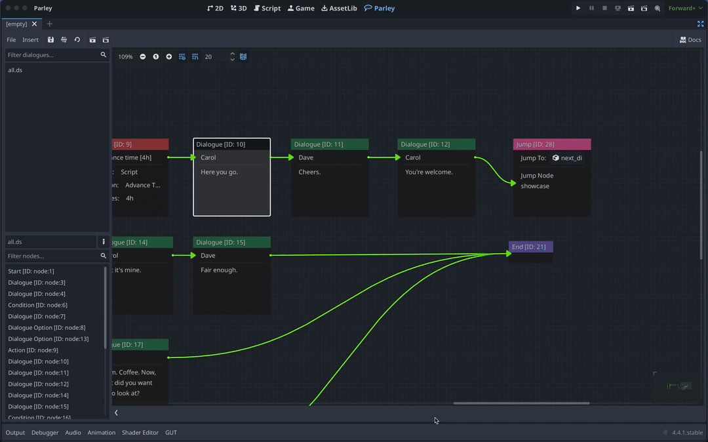

When testing and running Dialogue Sequences, Parley defines a default Dialogue
balloon that is used by default to render the Dialogue Sequence nodes. This can
be customised using the Parley settings.

## Prerequisites

- Ensure you have familiarised yourself with the
  [settings](../reference/parley-settings.md) docs.
- Parley is [installed](../getting-started/installation.md) and running in your
  Godot Editor.
- You have created a basic Dialogue Sequence before. Consult the
  [Getting Started guide](../getting-started/create-dialogue-sequence.md) for
  more info.

## Instructions

1. Change the Dialogue Balloon Path in the Parley settings: `Project` ->
   `Project Settings...` -> `General` -> `Parley` -> `Dialogue` ->
   `Dialogue Balloon Path`. In our example, we set this to:
   `res://addons/parley/components/default_balloon.tscn`.
2. Save the Parley settings.
3. You can test out your Dialogue Sequence by clicking the Test Dialogue
   Sequence from beginning button to see the custom Dialogue Sequence.
