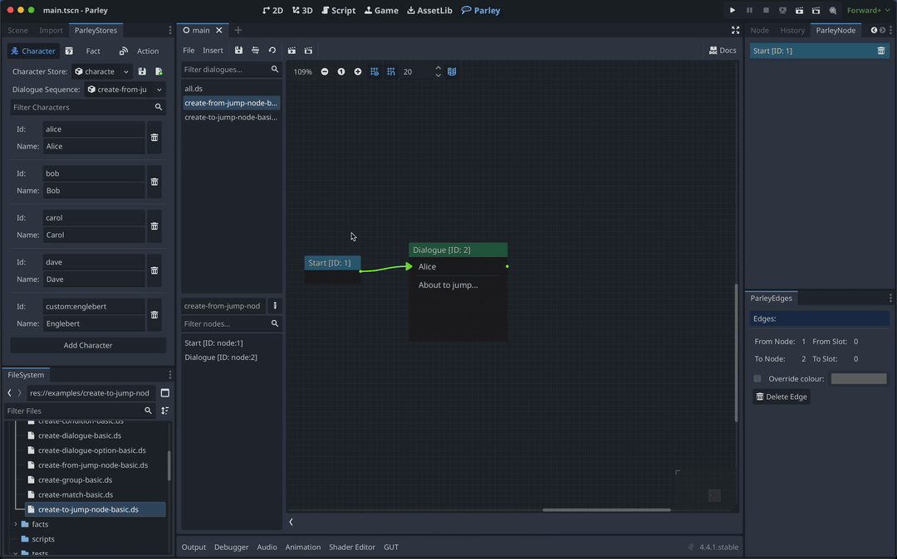

A Jump Node allows one to link Dialogue Sequences together by "jumping" from one
Dialogue Sequence to another. You can find all sorts of Dialogue Sequence
examples in the Parley
[`examples`](https://github.com/bisterix-studio/parley/tree/main/examples)
folder.

## Prerequisites

- Familiarise yourself with the [Jump Node](../nodes/jump-node.md) docs.
- Parley is [installed](./installation.md) and running in your Godot Editor.
- You have created a basic Dialogue Sequence before. Consult the
  [Getting Started guide](./create-dialogue-sequence.md) for more info.
- You have two Dialogue Sequences ready to use. One for "jumping" from and one
  for "jumping" to.

## Instructions

1. Create a Jump Node using the `Insert` dropdown.
2. Click on the created Jump Node in the graph view to open up the Jump Node
   Editor.
3. In the Jump Node Editor, choose a Dialogue Sequence to jump to either by
   dragging a Dialogue Sequence into the Resource Editor component or by using
   the Resource Editor dropdown menu. In this example, we drag the target
   Dialogue Sequence into the Resource Editor area.
4. Click the `Save` button in the Parley Editor and there we have it! Our first
   Dialogue Sequence with Jump Nodes.
5. You can test out your Dialogue Sequence by clicking the Test Dialogue
   Sequence From Start Button and ensure that the Dialogue Sequence jumps to the
   target Dialogue Sequence.
