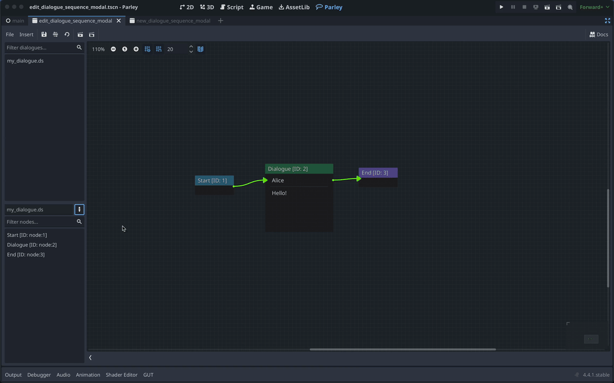

Once you have built a Dialogue Sequence, you will want to manage aspects of it.
For example, updating the title of the Dialogue Sequence. This guide will run
through how to go about managing your Dialogue Sequences. For creating a
Dialogue Sequence, please refer to the
[Create a Dialogue Sequence guide](./create-dialogue-sequence.md).

## Prerequisites

- Ensure you have familiarised yourself with the
  [key Parley concepts](../concepts/architecture.md).
- Parley is [installed](./installation.md) and running in your Godot Editor.
- You have an available Dialogue Sequence ready to be used and have created a
  basic Dialogue Sequence before. If not, please consult the
  [Getting Started guide](./create-dialogue-sequence.md) for more info.

## Instructions

### Update Dialogue Sequence title

1. Open your Dialogue Sequence in the main Parley view.

2. In the Parley sidebar on the left-hand side of the main view, click the
   `Edit` button next to the Dialogue Sequence file name.

3. Change the title to something meaningful. In this example, we choose:
   `My Dialogue Sequence`

4. Click the `Save` button in the Parley Editor and that's it!
