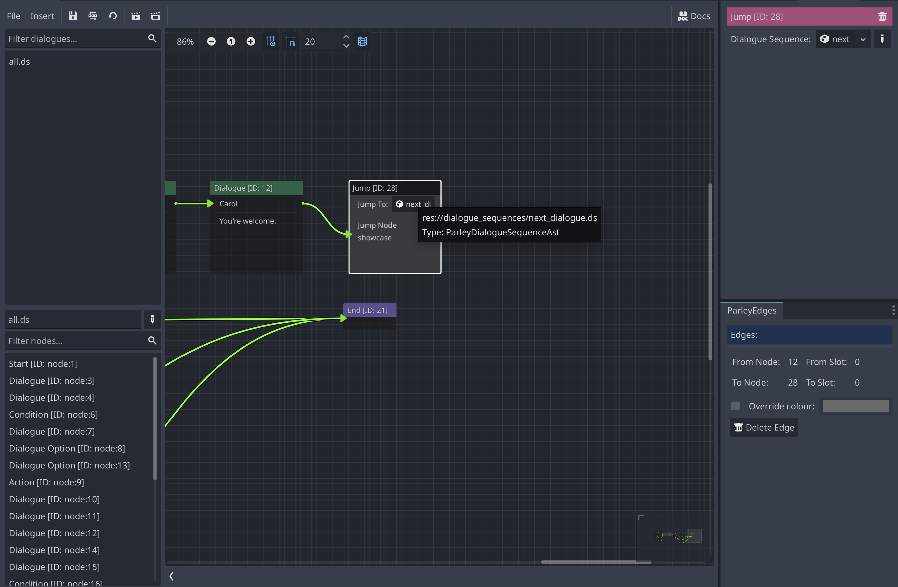

A Jump Node allows one to link Dialogue Sequences together by "jumping" from one
Dialogue Sequence to another. When it a Dialogue Sequence is run and the
processing encounters a Jump Node, it will jump to the defined Dialogue Sequence
and continue by processing the new Dialogue Sequence.

When jumping to a Dialogue Sequence, it will jump to the start of the target
Dialogue Sequence.

> [info]: At the moment, Parley does not support customising the starting Node
> of the target Dialogue Sequence. This functionality will be added in future
> versions of Parley.

They have the following characteristics:

## Dialogue Sequence AST Reference

The reference of the Dialogue Sequence AST that will be "jumped" to when the
Jump Node is processed.

> [warn]: In theory, you can Jump to the same Dialogue sequence, however this is
> not recommended because it is not visually clear where in the same Dialogue
> Sequence you are jumping to. In this case, it is recommended to use Edges to
> retain visual clarity of your Dialogue Sequence flow.
